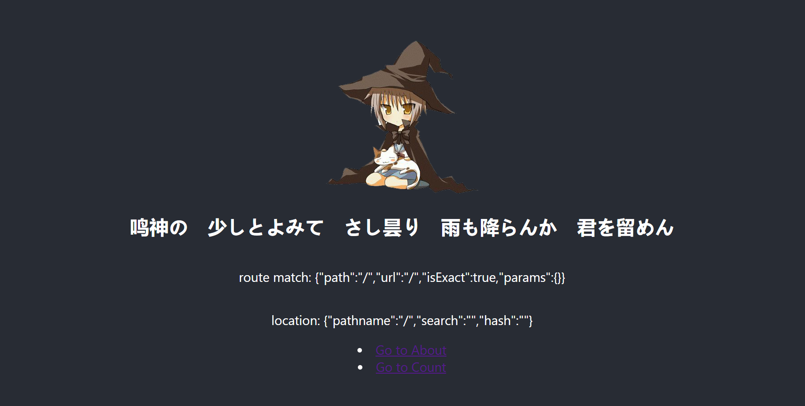
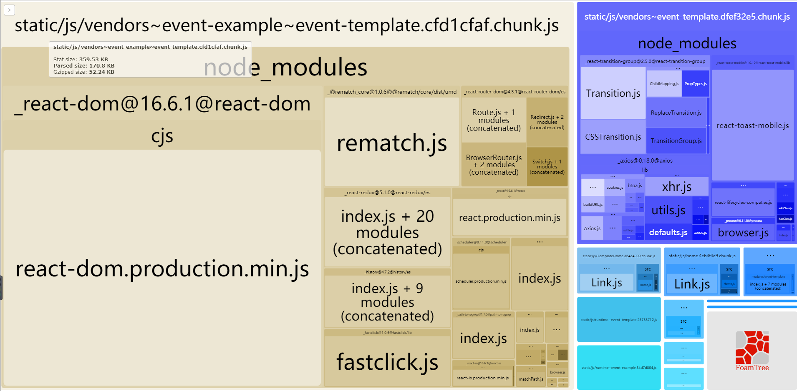

## react multi SPA

Multi SPA + Dynamic route.

- `npm i`
- `npm start`

访问 `http://localhost:3000/event-template`

另一个页面访问 `http://localhost:3000/event-example`

## 开始

每个（期）活动可以是一个单独的SPA。如果有新一期的活动，可按以下步骤

- 在`src/modules`文件夹下新建一个`event-${活动名}`的文件夹
- 将`src/modules/event-template`下的文件复制，进去，进行相应修改
- 一般来说需要修改以下几项：

1. 修改`<Router basename="/event-template">`里的basename为你的`event-${活动名}`
2. 部署服务时，配置路由重写。将`event-${活动名}` 重写为=> `event-${活动名}.html`

- 静态文件可放在 `public/assets` 目录

## Bundle 分析

- `npm run analyze` // to see bundle detail

## 请勿删除 event-template 目录

## 效果预览

## bundle预览

